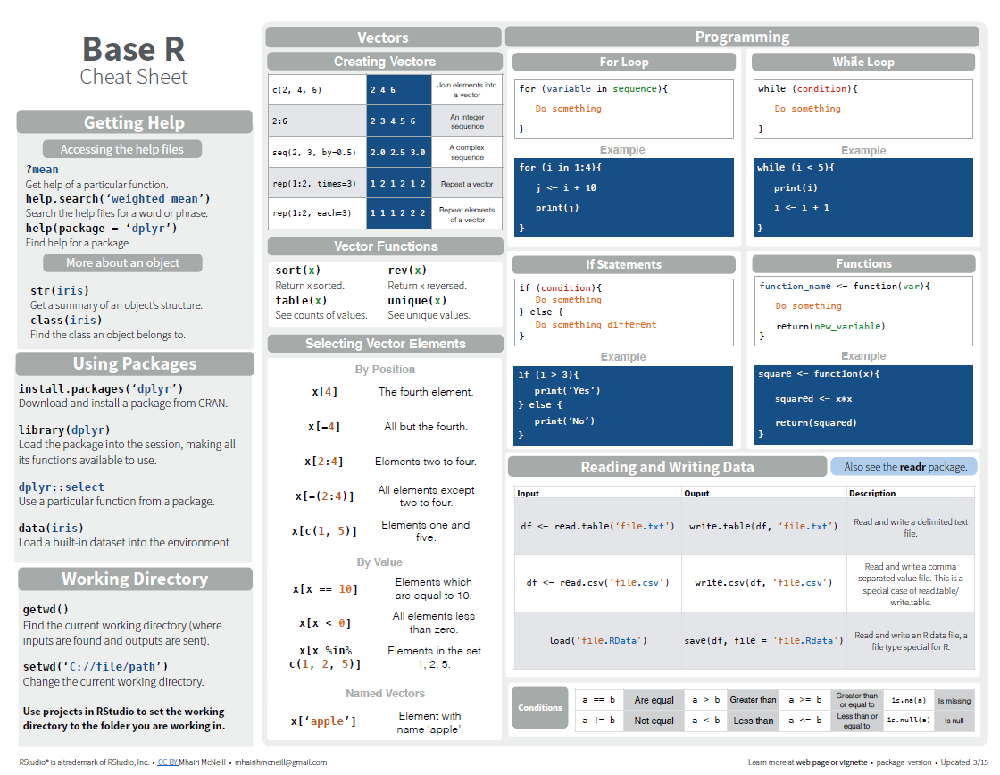

## R
R is a specialized language most commonly used for statistical computing, data analysis, and implementing graphics. It is open-source and free. R Language is widely used by statisticians and data miners for developing statistical software and data analysis. It helps to perform data wrangling, analyzing, and visualizing data easily.

### Why use R 
- R is a very easy and powerful tool for any statistical operations which can also easily be learned by any person even from a non-technical background.
-	R offers a variety of packages each of which helps you perform different functions. As of 2021, there are **18839** available packages in R the list of which can be found [here](https://cran.r-project.org/web/packages/available_packages_by_name.html). 
-	R provides a wide variety of statistical (linear and nonlinear modeling, classical statistical tests (e.g., probability, std deviation, etc.), time series analysis, classification, clustering,) and graphical techniques and is highly extensible.

Based on the 2021 survey conducted by Kaggle, R was the third most used programming language by data professionals

 
Image Source: [Business Broadway, 2021](https://businessoverbroadway.com/2021/01/11/for-data-professionals-python-remains-top-programming-language-while-r-continues-to-decline/)

## Understanding R Studio and Console 

 RStudio is the integrated development environment (IDE) for the basic R software.
 It is available in two versions: 
- RStudio Desktop - Regular desktop application. 
- RStudio Server - Runs on a remote server and accessed RStudio using a web browser.

**Script Area:** - Write codes (or) scripts and run them separately. Also, create a document outline (located on the top right of the script area) in this section that shows all the cod headers in one space.

__Console:__ - Write and run the code together directly here. It also displays the history of any command or an error message in case of a code error.

**Environment** – List of objects and variables created and present in the current session and also shows the current project file name at the top right of the pane.

**Graphics:** - Displays the plots, packages, and has an important tab of files. The files option helps us navigate through the different folders of the current project and makes organizing and sorting things a lot better.

The preferences tab in the toolbar helps customize the margins, displays, and font sizes in the r studio.

## Help and Cheatsheets in RStudio 

help(function_name) – Provides detailed description of function in help window (bottom right) 
E.g., Run the command **help(sort)** in the console.

You will now get a complete description of the “sort” function in the help window 
Points to note: 

- If a function’s argument is not given any value (such as x in the above picture) in the help description, this value must be compulsorily specified while running the function 
- If a function’s argument is given a value (decreasing = FALSE in above pic) this value is the default value considered by R. It needs to be specified compulsorily when the argument’s value needs to be different.

**Cheatsheet** – In the wild and woolly world of R there are many packages and to summarize this package functions the cheat sheets come in handy. These cheat sheets are invaluable as learning tools. RStudio has created a large number of cheat sheets, including the one-page R Markdown cheat sheet, which is freely available [here](https://www.rstudio.com/resources/cheatsheets/)


