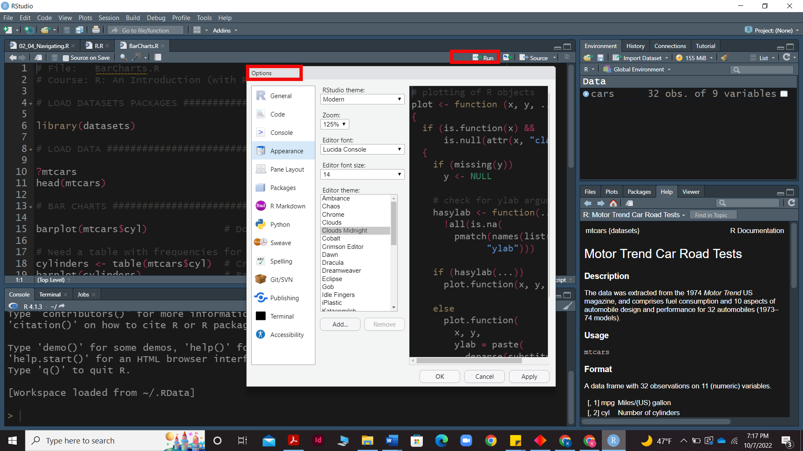

## R syntax 
Before learning how to code in R, it is necessary to understand the fundamentals of R. As an example, the code below performs basic arithmetic operations such as Addition (+), Subtraction (-), Multiplication (*), Division (/), and Modulo (%%), providing us with output similar to that of a basic calculator. Apart from these simple equations, R is capable of many additional functions for which the following operators are required.

operation directly in the console.
 ~~~
 > 2+2
 [1] 4
 > 2-2
 [1] 0
 >2*2
 [1] 4
 > 2/2
 [1] 1
 > 3%%2
 [1] 1

 ~~~
{: .language-r}

#### R Console essentials 
**Loading a Script in R** - R provides you with variety of options to run a script. In the Script pane you can either **copy and paste** a script or **type** a new script or area select **File → Open File → load an existing R Script** from the menu. 
**Run and options command in R** - The script's execution provides us with a code shown in the console pane, which is accessed by clicking the **RUN** button on the script pane or by pressing the **ctrl + Enter** keys.On the other hand we can access the options menu by going to **Menu bar>>tools>>options** which will provide you with a menue to change the apperance, accessibility and other settings of the R studio.

**Assigning values in R**- Values can be assigned to variables in R using the “<-” symbol. The variable is written on the left 
and is assigned the value on the right side. 
For example, to assign a value of 3 to x we can type the below code, **<- 3**
Assigning values to variables are quite useful especially if these values would be used again. 
Similar to the previous examples, operations can be performed on the variables to get output 
directly (or) the output can be stored in a different variable. 
Once a variable is created it will be visible under the environment section
~~~
> x <- 3
> y <- 5
> x+y
[1] 8
> z <- x+y
> z
[1] 8

 ~~~
{: .language-r}

**Commenting in R** - 
Comments are a way to improve your code’s readability and are only meant for the user so the interpreter ignores it. Comments starts with a **#** When executing the R-code, **R will ignore anything that starts with #**. Only single-line comments are available in R but we can also use multiline comments by putting then in **'** or **"** quotes.
Example:- **# This is a comment**
"Hello World!"

**Function in R**
A key feature of R is functions. Functions are “self contained” modules of code that accomplish a specific task. Functions usually take in some sort of data structure (value, vector, dataframe etc.), process it, and return a result.
The general usage for a function is the name of the function followed by parentheses:**function_name(input)**

One thing to be aware of is that R is **case-sensitive**. Hence variable “a” is different from “A”

### LOGICAL OPERATORS
Provides a list of Boolean results based on operation performed 
- < Less than

- <= Less than or equal to 

- \>  Greater than

- \>= Greater than or equal to
 
- ==  Equal to

- ! = Not equal to

- x&y  AND operation

- x\|y  OR operation 

- !x  NOT operation

Please note that in R the Boolean values “TRUE” & “FALSE” can also be written as “T” &” F”.

