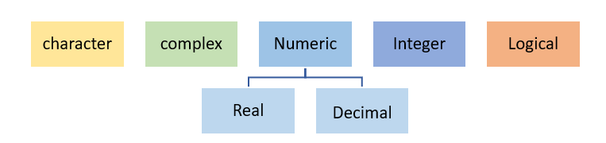

## **Variables**

-Variable are basically a **storage location** where you store some type of value and where that value can be altered based on your need.
Variable is also known as **Identifier** because the variable name identifies the value that is stored in the memory (RAM). 
As we Know R is a case-sensitive language hence a variable ABC = 15 and Abc= 32 can have different values.

### Naming Variables
-	Variable name must start with “letter” and can contain a number, letter, underscore (\_) and period (‘.’) 
```diff
+ variableName1, one.variable 
```

-	Underscores (\_) at the beginning of the variable name is not allowed. 
```diff
- _variable_one.
```
-	Periods (.) at the beginning of the variable name are allowed but should not be followed by a number eg - 
 ```diff
 - .1myvariable
 ```
-	Reserved words or keywords are not allowed to be identified as a variable name.

-	Special characters such as “#”, “&’, etc., along with white spaces (tabs, space) are not allowed in a variable name


## **Data Types**

Data type in R specifies the size and type of information the variable will store.
  
  R language has five main data types



#### Checking data type in R 

There are several functions that can show you the data type of an R object, such as **typeof**, **mode**, **storage.mode, class** and **str**.the main use of some of them is not to just check the data type of an R object. For instance, the class of an R object can be different from the data type and the str function is designed to show the full structure of an object. If you want to print the R data type, we recommend using the typeof functio
There are other functions that allow you to check if some object belongs to some data type, returning **TRUE or FALSE**. As a rule, these functions start with **is.** followed by the data type.

**Example- is.numeric(4) #true**

#### Data type coercion 

You can coerce data types in R with the functions starting with **as.**, summarized

~~~
as.numeric == numeric
as.integar == integer 
as.double == double 
as.character == Character
as.logical== Boolean
as.raw ==	 Raw

~~~
{:.language-r}

### Character data type 

Character data type stores value or strings and contains alphabets, numbers, and symbols
Character data type value is written withing single (‘ ‘)or double inverted quotes (“ “) 
Example- “A”, “2.21”, “skill@”.

~~~
# input code
# Declaring character value with double quotes ""
charac <- "Abcd"
charac
class(charac)

#Convert values to character data type.
pi_value <- 3.14
x <- as.character(pi_value)
x
class(x)

# Concatenation of Character
firstname <- "Kasturi "
lastname <- "Acharya"

# Character Value Concatenation
# Paste function is used to concatenate characters
full_name <- paste (firstname, lastname)
full_name

~~~
{:.language-r}
~~~
# output
# Declaring character value with double quotes ""
> charac <- "Abcd"
> charac
[1] "Abcd"
> class(charac)
[1] "character"

> #Convert values to character data type.
> pi_value <- 3.14
> x <- as.character(pi_value)
> x
[1] "3.14"
> class(x)
[1] "character"
> 
> # Concatenation of Character
> first_name <- "Kasturi"
> last_name <- "Acharya"
> 
> # Character Value Concatenation
> # Paste function is used to concatenate characters
> full_name <- paste (first_name,last_name)
> full_name
[1] "Kasturi Acharya"

~~~
{: .output}

### Complex data type 

-	R supports a set of all complex numbers and also stores numbers with an imaginary component.
Examples: 1+3i, 5i, 5- 9i

~~~

# input code
# Assign complex value to x
x <- 10 + 6i + 20
x
class(x)
z <- 6i
z
class(z)

#Using as.complex() function to convert value to complex.
as.complex(5)
as.complex(7i)

#Performing Addition on Complex Numbers
y1 <- 7+3i
y2 <- 8+9i
sum_y <- y1+y2
sum_y
class(sum_y)

~~~
{: .language-r}

~~~
# output
> # Assign complex value to x
> x <- 10 + 6i + 20
> x
[1] 30+6i
> class(x)
[1] "complex"
> z <- 6i
> z
[1] 0+6i
> class(z)
[1] "complex"

> #Using as.complex() function to convert value to complex.
> as.complex(5)
[1] 5+0i
> as.complex(7i)
[1] 0+7i

> #Performing Addition on Complex Numbers
> y1 <- 7+3i
> y2 <- 8+9i
> sum_y <- y1+y2
> sum_y
[1] 15+12i
> class(sum_y)
[1] "complex"
> 
~~~
{: .output}

### Numeric Data Type 

-	This data type represents all real numbers with or without decimal values, and is most commonly used data type.
 Example: - 1, 20.5, -97.05, -65 

~~~

# input code
# Assigning a decimal value to variable x
x <- 15.6
x
class(x)
typeof(x)

x1 <- 20
x1
class(x1)
typeof(x1)


# Converting an integer value to numeric type
x2 <- 22L
class(x2)
typeof(x2)
x3 <- as.numeric(x2)
x3
class(x3)
typeof(x3)

~~~
{: .language-r}

~~~
# output
> # Assigning a decimal value to variable x
> x <- 15.6
> x
[1] 15.6
> class(x)
[1] "numeric"
> typeof(x)
[1] "double"
> 
> x1 <- 20
> x1
[1] 20
> class(x1)
[1] "numeric"
> typeof(x1)
[1] "double"
> 
> # Converting an integer value to numeric type
> x2 <- 22L
> class(x2)
[1] "integer"
> typeof(x2)
[1] "integer"
> x3 <- as.numeric(x2)
> x3
[1] 22
> class(x3)
[1] "numeric"
> typeof(x3)
[1] "double"

~~~
{: .output}

### Integer Data Type 

-	Integer data type stores non-decimal values and is denoted with by adding Capital **L** afer a value.The as. integer () function can be used to convert a number into integer type data in R.
Example – 5, 102, 600, 1003.

~~~

# input code
x <-  18L # putting capital 'L' after a value forces it to be
# stored as Integer.
class(x)

y <-  9
class(y)

x1 <-  23.0L
x1 <-  23L
class(x1)

# Using integer function to declare an Integer type value 
y1 <-  as.integer(44)
class(y1)

#coerce a numeric value into integer
y2 <-  as.integer(45.2)
y2


#Convert Logical States to Integer
Logic_True <- as.integer(TRUE)
Logic_True


# To check if the value is integer type:
is.integer(x)
is.integer(y)
is.integer(y1)

#Creating integer vector from 1 to 5
m = 1:5
m
class(m)

~~~
{: .language-r}

~~~
# output
> 
> x <-  18L # putting capital 'L' after a value forces it to be
> # stored as Integer.
> class(x)
[1] "integer"
> 
> 
> y <-  9
> class(y)
[1] "numeric"
> 
> 
> x1 <-  23.0L
Warning message:
integer literal 23.0L contains unnecessary decimal point 
> x1 <-  23L
> class(x1)
[1] "integer"
> 
> 
> # Using integer function to declare an Integer type value 
> y1 <-  as.integer(44)
> class(y1)
[1] "integer"
> 
> #coerce a numeric value into integer
> y2 <-  as.integer(45.2)
> y2
[1] 45

> #Convert Logical States to Integer
> Logic_True <- as.integer(TRUE)
> Logic_True
[1] 1
 
> # To check if the value is integer type:
> is.integer(x)
[1] TRUE
> is.integer(y)
[1] FALSE
> is.integer(y1)
[1] TRUE
> 
> 
> #Creating integer vector from 1 to 5
> m = 1:5
> m
[1] 1 2 3 4 5
> class(m)
[1] "integer"
> 
~~~
{: .output}

~~~
# input code
# BONUS
#Integers value can be a maximum 2147483647 (2 billion)
.Machine$integer.max 

#Double value can be a maximum 1.797693e+308 (very much > than 2B)
.Machine$double.xmax 

~~~
{: .language-r}

### Logical Data Type 
-	This data type stores logical or Boolean values which are often generated as a result of logical operations.
Example – TRUE, FALSE

~~~
# input code
x <- TRUE
y<- FALSE

x1 <- T
y1 <- F

typeof(x1)
mode(x1)

####################
# Value Comparison #
####################

# Less Than and Greater Than Comparison
32 < 98  # TRUE Statement
37 > 52  # FALSE Statement
57 == 34  # FALSE Statement
80 == 80  # TRUE Statement
~~~
{: .language-r}

~~~
# output
 x <- TRUE
> y<- FALSE
> 
> x1 <- T
> y1 <- F
> typeof(x1)
[1] "logical"
> mode(x1)
[1] "logical"

> # Value Comparison #
>
> # Less Than and Greater Than Comparison
> 32 < 98  # TRUE Statement
[1] TRUE
> 37 > 52  # FALSE Statement
[1] FALSE
> # Equal TO Comparison
> 57 == 34  # FALSE Statement
[1] FALSE
> 80 == 80  # TRUE Statement
[1] TRUE
~~~
{: .output}



