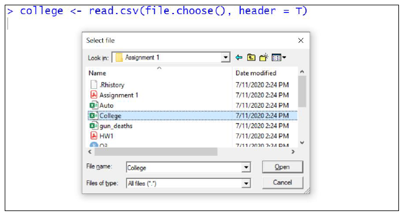

## Data Frames 

Data frames are used for storing Data tables in R. They are two-dimensional array structures and are similar to tables where each column represents one variable.
The main features to note about a data frame are: 

- Columns can be of different data types 
- Each column name must be unique 
- Each column should be of the same length i.e., contain the same number of elements
 
Data frames in R can be created in two ways: 
- Using data.frame() command 
- Importing data from files such as .csv, .xlsx etc. 

### data.frame() FUNCTION: 
While using the command we can follow the below syntax 
data. Frame (column_1, column_2, column_3, …………………….) 
Make sure that the names of the columns are unique and are of the same length.

#### **Creating a data frame**
~~~
# input code

# Student ID, names and their marks.
student.data <- data.frame(
   std_id = c(001:005),
   std_name = c("William", "James", "Olivia", "Steve", "David"),
   std_marks = c(84.8, 98.4, 74.6, 80, 95)
)

# Display the dataframe student.data
student.data

# Check the structure of the dataframe student.data
str(student.data)

#check the head and tail of the dataframe student.data
head(student.data, 3)

tail(student.data, 3)

# Check the summary, lenth and dimension of the dataframe student.data
summary(student.data)

length(student.data)

dim(student.data)

# Check number of row/columns individually.
ncol(student.data)
nrow(student.data)

~~~
{: .language-r}

~~~
#output 
> # Student ID, names and their marks.
> student.data <- data.frame(
+    std_id = c(001:005),
+    std_name = c("William", "James", "Olivia", "Steve", "David"),
+    std_marks = c(84.8, 98.4, 74.6, 80, 95)
+ )
> 
> # Display the dataframe student.data
> student.data
  std_id std_name std_marks
1      1  William      84.8
2      2    James      98.4
3      3   Olivia      74.6
4      4    Steve      80.0
5      5    David      95.0
> 
> # Check the structure of the dataframe student.data
> str(student.data)
'data.frame':	5 obs. of  3 variables:
 $ std_id   : int  1 2 3 4 5
 $ std_name : chr  "William" "James" "Olivia" "Steve" ...
 $ std_marks: num  84.8 98.4 74.6 80 95
> 
> #check the head and tail of the dataframe student.data
> head(student.data, 3)
  std_id std_name std_marks
1      1  William      84.8
2      2    James      98.4
3      3   Olivia      74.6
> 
> tail(student.data, 3)
  std_id std_name std_marks
3      3   Olivia      74.6
4      4    Steve      80.0
5      5    David      95.0
> 
> 
> # Check the summary, lenth and dimension of the dataframe student.data
> summary(student.data)
     std_id    std_name           std_marks    
 Min.   :1   Length:5           Min.   :74.60  
 1st Qu.:2   Class :character   1st Qu.:80.00  
 Median :3   Mode  :character   Median :84.80  
 Mean   :3                      Mean   :86.56  
 3rd Qu.:4                      3rd Qu.:95.00  
 Max.   :5                      Max.   :98.40  
> 
> length(student.data)
[1] 3
> 
> dim(student.data)
[1] 5 3
> 
> # Check number of row/columns individually.
> ncol(student.data)
[1] 3
> nrow(student.data)
[1] 5
~~~
{: .output}
### Importing data 
There are multiple commands with various arguments to import data from different file formats into R environment. I shall show the simplest command to import a csv file as a data frame 

data_frame_name <- read.csv(file. choose(), header = T)
Here, file. choose() - Allows you to choose a .csv file stored in your local desktop
Here, header = T - Indicates the first row in the file contains column names.

Double click (or) click once and select open on your desired file to import 
Once the data has been imported successfully the data frame would be visible with its name in the Environment pane on the top right.

### Packages 

-	One of the most important things in R is its collection of Packages. The package is a collection of R functions, data, and compiled code and Library is the location where the packages are stored. In order to access these packages, we can either go to **r-project. Org > CRAN> 0 Cloud> packages>CRAN task view** or use the **command library()** to load the package in the current R session.
-	Then just call the appropriate package functions 

install.packages("package_name") – Install the package from CRAN repository 

install.packages( c("package_1", “"package_2", "package_3") ) -Install multiple packages

library("package_name") – Load the package in current R session.

#### **Importing dataset and Packages**
~~~
getwd()
Install Package############################
# I recommend "pacman" for managing add-on packages. It will
# install packages, if needed, and then load the packages.
install.packages("pacman")

# Then load the package by using either of the following:
require(pacman)  # Gives a confirmation message.
library(pacman)  # No message.

# Or, by using "pacman::p_load" you can use the p_load
# function from pacman without actually loading pacman.
# These are packages I load every time.
pacman::p_load(pacman, dplyr, GGally, ggplot2, ggthemes, 
  ggvis, httr, lubridate, plotly, rio, rmarkdown, shiny, 
  stringr, tidyr) 

library(datasets)  # Load/unload base packages manually

# CLEAN UP #################################################

# Clear packages
p_unload(dplyr, tidyr, stringr) # Clear specific packages
p_unload(all)  # Easier: clears all add-ons
detach("package:datasets", unload = TRUE)  # For base

# Clear console
cat("\014")  # ctrl+L

Using Tidyverse#############################################
install.packages("tidyverse")
library (tidyverse)

Importing Data #############################################
df <- read.csv("StateData.csv")
df
head(df)
str(df) 
summary (df)

df[c("State", "governor")]
head(df[c("State", "governor")])
summary(df[c("State", "governor")]) 
sum (df[c("State", "governor")]))
df = df.sum(axis=1)
df1 <- c(sum(df$instagram), sum(df$facebook))
df1
c (sum(df$instagram), sum(df$retweet))
sum(df$State) # character datatype
mean(df$instagram)
"1" %in% df$instagram
~~~
{: .language-r}


