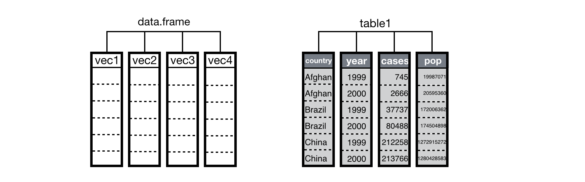

## Data Frames 

Data frames are used for storing Data tables in R. They are two-dimensional array structures and are similar to tables where each column represents one variable.
The main features to note about a data frame are: 

- Columns can be of different data types 

- Each column name must be unique 

- Each column should be of the same length i.e., contain the same number of elements
 
Data frames in R can be created in two ways: 
- Using data.frame() command 
- Importing data from files such as .csv, .xlsx etc. 

### data.frame() FUNCTION: 
While using the command we can follow the below syntax 

data. Frame (column_1, column_2, column_3, …………………….) 

Make sure that the names of the columns are unique and are of the same length.

### Creating a data frame
~~~
# input code

# Student ID, names and their marks.
student.data <- data.frame(
   std_id = c(001:005),
   std_name = c("William", "James", "Olivia", "Steve", "David"),
   std_marks = c(84.8, 98.4, 74.6, 80, 95)
)

# Display the dataframe student.data
student.data

# Check the structure of the dataframe student.data
str(student.data)

#check the head and tail of the dataframe student.data
head(student.data, 3)

tail(student.data, 3)

# Check the summary, lenth and dimension of the dataframe student.data
summary(student.data)

length(student.data)

dim(student.data)

# Check number of row/columns individually.
ncol(student.data)
nrow(student.data)

~~~
{: .language-r}

~~~
#output 
> # Student ID, names and their marks.
> student.data <- data.frame(
+    std_id = c(001:005),
+    std_name = c("William", "James", "Olivia", "Steve", "David"),
+    std_marks = c(84.8, 98.4, 74.6, 80, 95)
+ )
> 
> # Display the dataframe student.data
> student.data
  std_id std_name std_marks
1      1  William      84.8
2      2    James      98.4
3      3   Olivia      74.6
4      4    Steve      80.0
5      5    David      95.0
> 
> # Check the structure of the dataframe student.data
> str(student.data)
'data.frame':	5 obs. of  3 variables:
 $ std_id   : int  1 2 3 4 5
 $ std_name : chr  "William" "James" "Olivia" "Steve" ...
 $ std_marks: num  84.8 98.4 74.6 80 95
> 
> #check the head and tail of the dataframe student.data
> head(student.data, 3)
  std_id std_name std_marks
1      1  William      84.8
2      2    James      98.4
3      3   Olivia      74.6
> 
> tail(student.data, 3)
  std_id std_name std_marks
3      3   Olivia      74.6
4      4    Steve      80.0
5      5    David      95.0
> 
> 
> # Check the summary, lenth and dimension of the dataframe student.data
> summary(student.data)
     std_id    std_name           std_marks    
 Min.   :1   Length:5           Min.   :74.60  
 1st Qu.:2   Class :character   1st Qu.:80.00  
 Median :3   Mode  :character   Median :84.80  
 Mean   :3                      Mean   :86.56  
 3rd Qu.:4                      3rd Qu.:95.00  
 Max.   :5                      Max.   :98.40  
> 
> length(student.data)
[1] 3
> 
> dim(student.data)
[1] 5 3
> 
> # Check number of row/columns individually.
> ncol(student.data)
[1] 3
> nrow(student.data)
[1] 5
~~~
{: .output}

### Accessing Dataframe

~~~
# input code

student.dataMaths <- data.frame(
  std_id = c(001:005),
  std_name = c("William", "James", "Olivia", "Steve", "David"),
  std_marks_maths = c(56.7, 60.8, 87.1, 55, 62.7)
)

# select columns
student.dataMaths[1]
student.dataMaths[-2]

#selecting columns ONLY data frames
# give the values as vector
student.dataMaths$std_marks_maths

#dataframe[Rows, Cols]

student.dataMaths[2]
student.dataMaths[2,]

student.dataMaths[c(1:3),]

~~~
{: .language-r}

~~~
# output
> student.dataMaths <- data.frame(
+    std_id = c(001:005),
+    std_name = c("William", "James", "Olivia", "Steve", "David"),
+    std_marks_maths = c(56.7, 60.8, 87.1, 55, 62.7)
+ )
> 
> # select columns
> student.dataMaths[1]
  std_id
1      1
2      2
3      3
4      4
5      5
> student.dataMaths[-2]
  std_id std_marks_maths
1      1            56.7
2      2            60.8
3      3            87.1
4      4            55.0
5      5            62.7
> 
> #selecting columns ONLY data frames
> # give the values as vector
> student.dataMaths$std_marks_maths
[1] 56.7 60.8 87.1 55.0 62.7
> 
> #dataframe[Rows, Cols]
> 
> student.dataMaths[2]
  std_name
1  William
2    James
3   Olivia
4    Steve
5    David
> student.dataMaths[2,]
  std_id std_name std_marks_maths
2      2    James            60.8
> 
> student.dataMaths[c(1:3),]
  std_id std_name std_marks_maths
1      1  William            56.7
2      2    James            60.8
3      3   Olivia            87.1

~~~
{: .output}

### Data Transformation 

~~~
#Input code 
student.dataEnglish <- data.frame(
   std_id = c(001:005),
   std_name = c("William", "James", "Olivia", "Steve", "David"),
   std_marks_eng = c(84.8, 98.4, 74.6, 80, 95)
)

student.marks <- data.frame(
   student.dataEnglish, 
   student.dataMaths[3])

student.marks

stud_6 <- data.frame(std_id = c(1:6))
stud_6

stud6_marks <- data.frame(
   student.dataEnglish, 
   stud_6)

student.dataEnglish

new_stdData <- data.frame(
   std_id = 006,
   std_name = "George",
   std_marks_eng = 75.6)

new_stdData

update.stdDataEng <- rbind(student.dataEnglish, new_stdData)

update.stdDataEng

~~~
{: .language-r}

~~~
# output
> student.dataEnglish <- data.frame(
+    std_id = c(001:005),
+    std_name = c("William", "James", "Olivia", "Steve", "David"),
+    std_marks_eng = c(84.8, 98.4, 74.6, 80, 95)
+ )
> 
> student.marks <- data.frame(
+    student.dataEnglish, 
+    student.dataMaths[3])
> 
> student.marks
  std_id std_name std_marks_eng std_marks_maths
1      1  William          84.8            56.7
2      2    James          98.4            60.8
3      3   Olivia          74.6            87.1
4      4    Steve          80.0            55.0
5      5    David          95.0            62.7
> 
> stud_6 <- data.frame(std_id = c(1:6))
> stud_6
  std_id
1      1
2      2
3      3
4      4
5      5
6      6
> 
> stud6_marks <- data.frame(
+    student.dataEnglish, 
+    stud_6)
Error in data.frame(student.dataEnglish, stud_6) : 
  arguments imply differing number of rows: 5, 6
> 
> student.dataEnglish
  std_id std_name std_marks_eng
1      1  William          84.8
2      2    James          98.4
3      3   Olivia          74.6
4      4    Steve          80.0
5      5    David          95.0
> 
> new_stdData <- data.frame(
+    std_id = 006,
+    std_name = "George",
+    std_marks_eng = 75.6)
> 
> new_stdData
  std_id std_name std_marks_eng
1      6   George          75.6
> 
> update.stdDataEng <- rbind(student.dataEnglish, new_stdData)
> 
> update.stdDataEng
  std_id std_name std_marks_eng
1      1  William          84.8
2      2    James          98.4
3      3   Olivia          74.6
4      4    Steve          80.0
5      5    David          95.0
6      6   George          75.6

~~~
{: .output}

### Data Operations

~~~
# input code
# Create a dataframe for user data containing their
# IDs, Names, Age and heights in cm.
user.data <- data.frame(
   user.sn = c(1:5),
   user.name = c("Mr. A", "Mrs B", "Mrs. C", "Mr. D", "Mr. D"),
   user.age = c(25, 50, 41, 29, 58),
   user.height = c(181, 165, 155, 162, 142)
)
user.data
# Calculating sum of ages 
sum(user.data$user.age)

# Calculating the mean of user ages
mean(user.data[[3]])

# Calculating standard deviation of user ages
sd(user.data$user.age)

# Searching for 180 in user.data dataframe
"180" %in% user.data$user.height

"165" %in% user.data$user.height

~~~
{: .language-r}

~~~
# output
> # IDs, Names, Age and heights in cm.
> user.data <- data.frame(
+    user.sn = c(1:5),
+    user.name = c("Mr. A", "Mrs B", "Mrs. C", "Mr. D", "Mr. D"),
+    user.age = c(25, 50, 41, 29, 58),
+    user.height = c(181, 165, 155, 162, 142)
+ )
> user.data
  user.sn user.name user.age user.height
1       1     Mr. A       25         181
2       2     Mrs B       50         165
3       3    Mrs. C       41         155
4       4     Mr. D       29         162
5       5     Mr. D       58         142
> # Calculating sum of ages 
> sum(user.data$user.age)
[1] 203
> # Calculating the mean of user ages
> mean(user.data[[3]])
[1] 40.6
> # Calculating standard deviation of user ages
> sd(user.data$user.age)
[1] 13.86723
> 
> # Searching for 180 in user.data dataframe
> "180" %in% user.data$user.height
[1] FALSE
> 
> "165" %in% user.data$user.height
[1] TRUE
~~~
{: .output}


